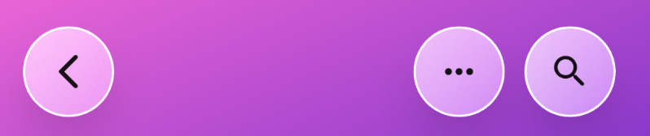
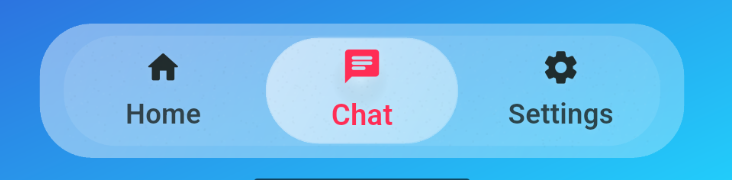
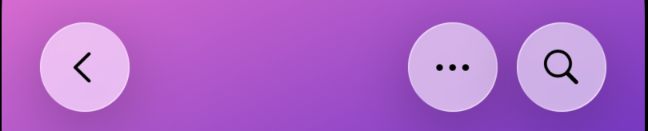
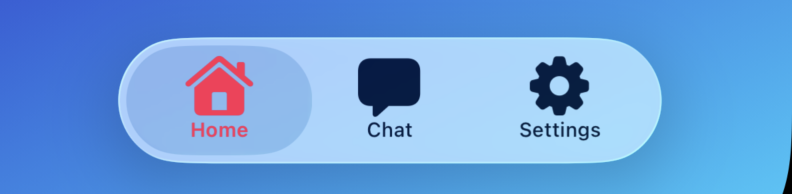

# glass_bottom_navigation

A customizable Liquid Glass bottom navigation bar for Flutter, with native
iOS 26 rendering and a Flutter fallback glass effect for Android and older iOS.

## Features

- Simple API: pass `items`, `currentIndex`, and `onTap`
- Optional built-in search action via `onSearchTap`
- Optional leading and trailing glass action buttons such as back, more, close,
  and custom icon buttons
- iOS 26+ native Liquid Glass bottom bar and action buttons when built with the
  latest Apple SDK
- Android and iOS < 26 use a Flutter Liquid Glass-style fallback with
  frosted surfaces, selected-pill effects, and press feedback
- Native SF Symbol support through `nativeSymbolName` for iOS 26+
- Optional `width` and `height` overrides
- Auto layout behavior:
  - Without search: centered bar
  - With search: trailing glass search button layout
- Auto sizing defaults:
  - Width: responsive to device size
  - Height: responsive to device size
- Supports only 2 to 4 navigation items (enforced by assertions)
- Optional `GlassBottomNavStyle` to customize appearance

## Getting started

Add the package:

```yaml
dependencies:
  glass_bottom_navigation: ^0.2.0
```

Then import:

```dart
import 'package:glass_bottom_navigation/glass_bottom_navigation.dart';
```

## Usage

```dart
GlassBottomBar(
  items: const [
    GlassBarItem(
      icon: Icons.home_rounded,
      label: 'Home',
      nativeSymbolName: 'house.fill',
    ),
    GlassBarItem(
      icon: Icons.chat_rounded,
      label: 'Chat',
      nativeSymbolName: 'bubble.left.fill',
    ),
    GlassBarItem(
      icon: Icons.person_rounded,
      label: 'Profile',
      nativeSymbolName: 'person.fill',
    ),
  ],
  currentIndex: currentIndex,
  onTap: (index) => setState(() => currentIndex = index),
  // Optional: if omitted, both are auto-sized responsively.
  width: 300,
  height: 60,
  onSearchTap: () {
    // Optional: if null, no search button is shown.
  },
)
```

## Platform behavior

| Platform | Rendering |
| --- | --- |
| iOS 26+ | Native UIKit/SwiftUI Liquid Glass bar and action buttons |
| iOS below 26 | Flutter-rendered Liquid Glass-style fallback |
| Android | Flutter-rendered Liquid Glass-style fallback |

For iOS 26+ native Liquid Glass rendering, pass `nativeSymbolName` on
`GlassBarItem` and custom action buttons so UIKit can render SF Symbols. Android
and iOS < 26 automatically use the Flutter fallback glass style. Also make sure
the host app does not opt into UI compatibility mode. If
`UIDesignRequiresCompatibility` is present in `Info.plist`, set it to `false`
while testing the latest native design.

To force the Flutter-rendered style on every platform, set
`actionButtonMode: GlassActionButtonMode.flutter` in `GlassBottomNavStyle`.

### Use glass action buttons

```dart
Column(
  children: [
    GlassActionButton(
      item: GlassActionButtonItem.back(
        onTap: () => Navigator.maybePop(context),
      ),
    ),
    const Spacer(),
    GlassBottomBar(
      items: items,
      currentIndex: currentIndex,
      onTap: onTap,
    ),
  ],
)
```

Action buttons can also be grouped anywhere in your layout:

```dart
GlassActionButtonRow(
  actions: [
    GlassActionButtonItem.more(onTap: openMenu),
    GlassActionButtonItem(
      type: GlassActionIcon.custom,
      icon: Icons.tune_rounded,
      nativeSymbolName: 'slider.horizontal.3',
      semanticLabel: 'Filters',
      onTap: openFilters,
    ),
  ],
)
```

Or attached directly beside the bottom bar when the screen has enough width:

```dart
GlassBottomBar(
  items: items,
  currentIndex: currentIndex,
  onTap: onTap,
  leadingActions: [
    GlassActionButtonItem.back(onTap: () => Navigator.maybePop(context)),
  ],
  trailingActions: [
    GlassActionButtonItem.more(onTap: openMenu),
  ],
)
```

### Customize style

```dart
GlassBottomBar(
  items: items,
  currentIndex: currentIndex,
  onTap: onTap,
  style: const GlassBottomNavStyle(
    accent: Color(0xFF004D40),
    height: 60,
    widthFactor: 0.90,
    actionButtonMode: GlassActionButtonMode.nativeLiquidGlassOnIOS26,
  ),
)
```

Some useful fallback styling knobs include `pillTint`, `pillBlurSigma`,
`pillFilmStart`, `pillFilmEnd`, `selectedStartOpacity`,
`selectedEndOpacity`, `searchButtonSize`, and `searchGap`.

## Example app

A full runnable demo exists in `/example` and includes:

- 2-tab, 3-tab, and 4-tab setups
- Native iOS 26 Liquid Glass rendering when available
- Android and iOS < 26 Flutter Liquid Glass fallback styling
- Standalone top glass action buttons for back, more, and search
- Bottom navigation used independently from action buttons

## Screenshots

### Android / Flutter action buttons



### Android / Flutter bottom bar



### iOS 26 native action buttons



### iOS 26 native bottom bar


